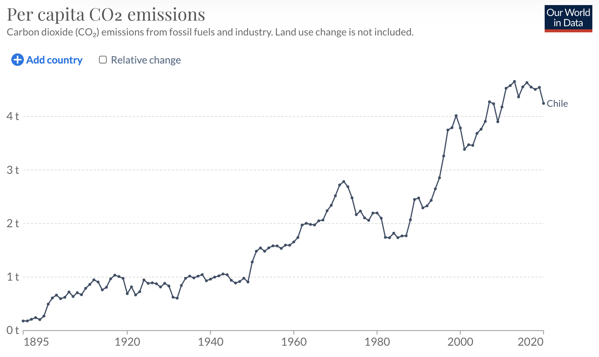

```{r setup, include=FALSE}
knitr::opts_chunk$set(echo = FALSE)
```

## Introducción
A pesar de los grandes avances tecnológicos, políticos y de comportamiento que se han producido en el mundo en los últimos años para enfrentar el cambio climático, es difícil exagerar el reto que el cambio climático supone para la política, lo que unido a la dificultad de conseguir reducciones significativas de las emisiones, plantea implicaciones de gran calado en la forma de hacer política. 

Son los propios políticos quienes, a través de las instituciones a nivel mundial, nacional y local, tienen la tarea de mediar en las respuestas a los complejos problemas relacionados con el clima. Sin embargo, es difícil encontrar un análisis sistemático del impacto de los discursos de los políticos de alto nivel sobre el cambio climático, especialmente en el comportamiento de la población en general con respecto al medio ambiente. Esto plantea la pregunta politica: 

#### Ha tenido efecto los discursos politicos relacionados con el clima en cambiar efectivamente los comportamientos generales de los ciudadanos?

Chile es particularmente vulnerable al cambio climático y ya está experimentando impactos del cambio climático. Entre otros efectos, Chile lleva acusando una sequía prolongada en el centro y sur del país desde el año 2010 (CR2, 2019). 

Los gases de efecto invernadero, como por ejemplo el CO2, son los que más contribuyen al cambio climático mundial, y Chile hile es el país número 140 del ranking de países por emisiones de CO2. En la figura se puede ver la evolución del CO2 per capita en lo país (Datosmacro, 2019).



En los últimos años, Chile ha introducido muchas políticas para luchar contra el cambio climático. Pero, ¿cómo entienden y articulan los políticos chilenos un tema tan complejo como el cambio climático?  ¿Y qué eficacia tienen a la hora de inducir un cambio real en el comportamiento de los ciudadanos y la concienciación medioambiental?

Para responder a estas preguntas, propongo analizar los discursos políticos relacionados con el medio ambiente en Chile, utilizando el análisis de sentimientos NLP y el análisis de corpus, para entender cómo se relacionan con el cambio de comportamiento real de los consumidores en las acciones medioambientales (por ejemplo, el reciclaje, el transporte, los patrones de compra, etc.).

## Variables Operacionales
1. Emissiones CO2eq
2. Santiago AQI index
3. Niveles PM2.5 
4. Tasas de reciclaje
5. Distancias percorridas en auto, bus y avión
6. Tipo de discurso politico
7. Entidad discursora

Para esto se puede recorrer a las seguintes bases de datos:
* [Instituto Nacional de Estadisticas](https://stat.ine.cl/Index.aspx?DataSetCode=E10000001)
* [Registro de Emisiones y Transferencias de Contaminantes (RETC)](https://datosretc.mma.gob.cl/organization/6cfad7e3-235c-47ef-8686-05dbf3ef6a0d?groups=emisiones-al-aire)
* [World Bank Data para Chile](https://data.worldbank.org/country/chile)
* [Emisiones de Chile segun el Banco Mundial Chile](https://datos.bancomundial.org/indicador/en.atm.co2e.pc?locations=CL)

## Hipotesis
Mi hipotesis es la siguiente: **Los discursos políticos sobre el medio ambiente no consiguen inducir un cambio de comportamiento en la población**.


## Referencias

* [CR2, 2019; La megasequía 2010-2019: Una lección para el futuro](https://www.cr2.cl/megasequia/)
* [Datosmacro, 2019; CO2 Chile](https://datosmacro.expansion.com/energia-y-medio-ambiente/emisiones-co2/chile)
* [Our World in Data, 2019; CO2 Emissions](https://ourworldindata.org/co2/country/chile)


