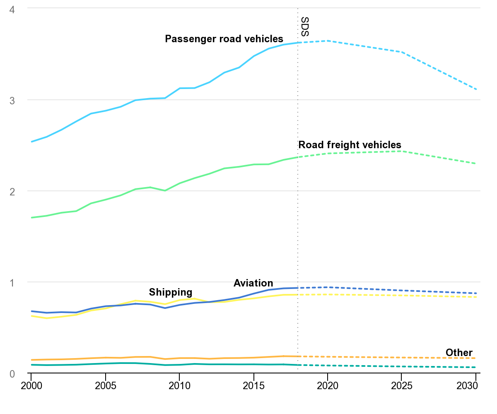

```{r setup, include=FALSE}
knitr::opts_chunk$set(echo = FALSE)
```


## Introducción
El sector del transporte es una de las mayores fuentes de emisiones de CO2 y una fuente importante de contaminación atmosférica. Dentro del transporte general los "Passenger Road Vehicles", es dicir los vehículos de transporte de pasajeros en carretera son los que más contaminan, incluso en comparación con "Road Freight Vehicles", "Aviation" and "Shipping" (International Energy Agency, 2021).



La contaminación de los vehículos es especialmente preocupante en las grandes ciudades, y puede convertirse en una de las principales causas de "Smog" y contaminación del aire.
El smog se forma al mezclar el aire con contaminantes y gases de escape resultantes de las actividades humanas. Entre los factores responsables se encuentran las fábricas, el creciente número de coches, la quema de carbón, madera y otros combustibles sólidos en las estufas. Su formación también viene determinada por el tiempo, el clima y las condiciones generales de la zona. Será mucho más difícil deshacerse de los contaminantes cuando una ciudad esté en un valle y el clima sin viento impida que se dispersen y se diluyan, haciendo que queden suspendidos sobre la ciudad. (Airly 2020)

Santiago, en particular, está anidada entre dos cordilleras, la de los Andes y la de la Costa, lo que crea una bolsa de aire viciado en el valle con una ventilación mínima, provocando un fuerte smog y contaminación, inducida por la cantidad de pequeñas partículas respirables, PM2,5, en el aire (COHA, 2015).

En el contexto del enfoque de ciudad inteligente, la integración de las innovaciones tecnológicas en los sistemas de movilidad urbana, por ejemplo con la micromovilidad compartida, contribuye a mejorar el medio ambiente y la calidad de vida.

En 2019, la Municipalidad de Santiago, con Bike Itaú, lanzó el nuevo sistema de bicicletas compartidas que tendrán los residentes y visitantes de la ciudad, con planes mensuales de menos de 4 000 pesos, con el fin de promover el uso de esta solución de micromovilidad y, en consecuencia, mejorar el medio ambiente. Esto plantea la pregunta politica: 

#### Ha tenido efecto la introducción de sistemas de bicicletas compartidas baratas y accessibles en a la polucion del aire en Santiago?

Para contestar esta pregunta con calidade, hay que entender cómo ha evolucionado la contaminación del aire en Santiago, así como el número de vehículos en circulación y su relación con el uso de este sistema.

## Variables Operacionales
1. Emissiones CO2eq
2. Santiago AQI index
3. Niveles PM2.5 
4. Utilización de Bike Itaú
5. Utilización de vehículos de pasajeros por carretera

Para esto se puede recorrer a las seguintes bases de datos:
* [Instituto Nacional de Estadisticas](https://stat.ine.cl/Index.aspx?DataSetCode=E10000001)
* [Registro de Emisiones y Transferencias de Contaminantes (RETC)](https://datosretc.mma.gob.cl/organization/6cfad7e3-235c-47ef-8686-05dbf3ef6a0d?groups=emisiones-al-aire)
* Informes Bike Itaú (pedido privado)


## Hipotesis
Mi hipotesis es la siguiente: *La utilización de bicicletas compartidas tien un relácion débil con la diminuición de la poluición del aire*

Argumentos:

La gente utiliza estos vehículos sobre todo para los desplazamientos que, de otro modo, habrían realizado a pie, en bicicleta (no eléctrica) o en transporte público (no sustituye a los coches).


## Referencias

* [Ineternational Energy Agency, 2021; Transport](https://www.coha.org/the-battle-to-breathe-chiles-toxic-threat/#_edn7)
* [Airly, 2020; What is Smog](https://airly.org/en/smog-definition-effects-and-causes/)
* [COHA, 2015; The Battle to Breathe: Chile’s Toxic Threat](https://www.iea.org/topics/transport)


