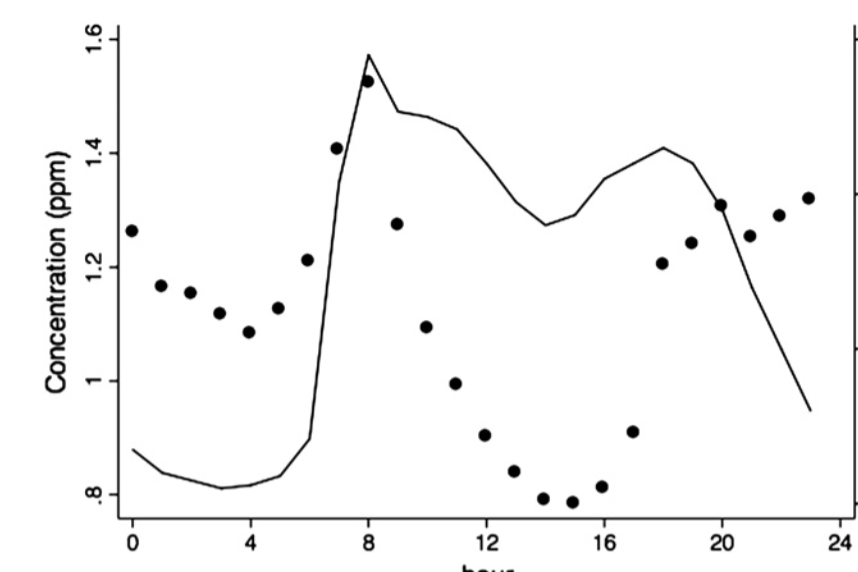
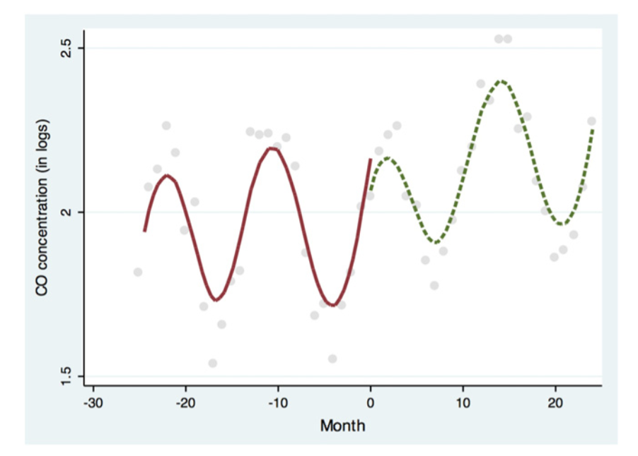

```{r setup, include=FALSE}
knitr::opts_chunk$set(echo = FALSE)
```

## Recopilación de Datos

Como se discutió en las publicaciones anteriores, trataremos con 3 tipos de datos:

1. Datos de series temporales de concentraciones de CO (variable dependiente) y SO2;
2. Datos de series de tiempo de las condiciones climáticas (velocidad del viento, dirección del viento, humedad relativa y temperatura);
3. Datos de ubicación tanto de las estaciones de monitoreo como de las estaciones de Bike Itaú.

Todos estos datos fueron recolectados manualmente. Del Sistema de Información Nacional de la Calidad del Aire (SINCA), disponible en https://sinca.mma.gob.cl/index.php/region/index/id/M, fue posible recopilar todos los datos sobre la estaciones de monitoreo (todos los datos de series de tiempo). Esta información se recopiló en archivos .csv individuales de 9 de 14 estaciones, ya que solo estas 9 tenían datos para el período de tiempo previsto (2018 - 2020), lo que nos deja un total de 49 archivos, 1 archivo por estación de monitoreo (9 ) por variable (6), a excepción de los datos de SO2, que solo estaban disponibles para el período de tiempo previsto en 4 estaciones ($9 \cdot 5 + 4 = 49$). Estos archivos están disponibles en _assets/Data en el [repositorio de GitHub](https://github.com/diogovalentepcs/politcaldatascience) de este proyecto.

En cuanto a los datos de ubicación, se creó un archivo de Excel independiente con 2 hojas, la primera con los nombres y ubicaciones (en tipo UTM) de las estaciones de monitoreo (recolectadas de SINCA), y la segunda hoja con los ID's, capacidad y coordenadas (latitud y longitud) de cada estación de bicicletas compartidas en Santiago (todas pertenecientes a Bike Itaú). Para esta última información se utilizó Google Maps, lo que me permitió recopilar información de 118 estaciones.

## Preparación de los Datos

La preparación de los datos requiere los siguientes pasos:

1. Filtrado de los conjuntos de datos para el período comprendido entre el 02-01-2018 y el 02-01-2020 (exactamente un año antes y después de la renovación del sistema de Bike Itaú);
2. Fusionar todos los conjuntos de datos en uno solo, con diferentes valores de indicador en diferentes columnas;
3. Validar las conclusiones de artículos anteriores sobre los mejores plazos para analizar la concentración de CO (por ejemplo, las dos horas consecutivas que en promedio marcan las lecturas más altas de CO en la muestra de dos años);
4. Filtre el conjunto de datos para esas horas (7 a. m. a 9 a. m.);
5. Agregue valores para la contaminación de fondo antes de que se forme el pico y considere el promedio de 4 registros de CO consecutivos que, en promedio, mostraron la menor dispersión en el transcurso de la muestra (1 a. m. a 5 a. m.)
6. Construir las variables ficticias que identifican las observaciones posteriores a la implementación, así como el indicador del mes;
7. Pupular con variables para día de la semana, hora del día y mes del año (dummies)

Sobre los datos de ubicación, se requiere:
1. Uniformizar los tipos de datos de ubicación;
2. Calcule las distancias lineales entre cada estación de monitoreo y todas las estaciones de bicicletas, y sume dichas distancias

## Visualizaciones previstas

El principal interés de las visualizaciones es investigar el comportamiento de la variable dependiente (CO), con el fin de validar cómo se construye el modelo. Por lo tanto, el objetivo es crear visualizaciones como estas:





Además, los outliers deben estudiarse a través de boxplots para emisiones y variables climáticas, y, las correlaciones entre estos también deben estudiarse gráficamente.
